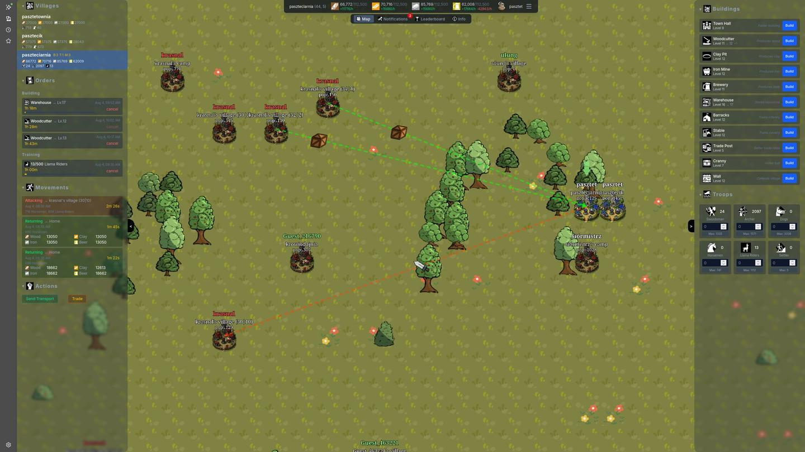

<p align="center"></p>

[](https://opensource.org/licenses/MIT)
[](https://kubastuff.eu/southvale)
[](https://kubastuff.eu/southvale/api/scalar)
[](ARCHITECTURE.md)
[](docs.md)

Real-time multiplayer browser strategy game. Players build and extend their villages, train beer-fueled armies and attack opponents. Playable on desktop and mobile.

**Play:** [kubastuff.eu/southvale](https://kubastuff.eu/southvale) 

**API:** [kubastuff.eu/southvale/api/scalar](https://kubastuff.eu/southvale/api/scalar)


## Quick Start

```bash
# Full stack (first time: copy .env.example -> .env and adjust variables)
cp .env.example .env
docker compose up -d --build

# Or dev mode
docker compose up -d postgres   # backend needs the DB
cd backend/TownManager.Api && dotnet run
cd client && npm install && npm run dev
```

Dev mode note: expose Postgres on host port 5432 — uncomment `ports` under
`postgres` in `docker-compose.yml`, or use docker-compose.override.yml`.

## Features

- 4-resource economy (wood, clay, iron, beer) 
- 11 building types (townhall, barracks, stables, warehouse, cranny, wall, trade post, production buildings)
- 6 troop types (swordsmen, archers, settlers, dogs, llama riders, horsemen)
- Attack, transport, and settle mechanics 
- LLM-driven players/bots
- Barbarian NPC villages that grow and attack periodically
- PixiJS map with pan, zoom, and village selection
- Map editor for terrain authoring


## Tech Stack

**Backend:** .NET 10, Clean Architecture, CQRS with MediatR, PostgreSQL + EF Core, Hangfire (background jobs), SignalR (real-time), JWT + ASP.NET Identity, FluentValidation, Serilog, Scalar (OpenAPI)

**Frontend:** React 19, TypeScript, PixiJS 8 (map rendering), TanStack Router + Query, Zustand (client state), Axios, SignalR, Tailwind CSS, Vite

**Infrastructure:** Docker Compose (PostgreSQL, pgAdmin, backend)

## Screenshot

<p align="center"><a href="screenshot.jpg"></a></p>

## Tests & CI

- 3 test projects: Domain, Application (NSubstitute mocks), Integration —
  xUnit v3 + FluentAssertions
- GitHub Actions: `dotnet test` on every push/PR; deploy workflow to VPS
  (see [.github/workflows](.github/workflows))

## Links

- [ARCHITECTURE.md](ARCHITECTURE.md)
- [docs.md](docs.md)
- [LICENSE](LICENSE)

